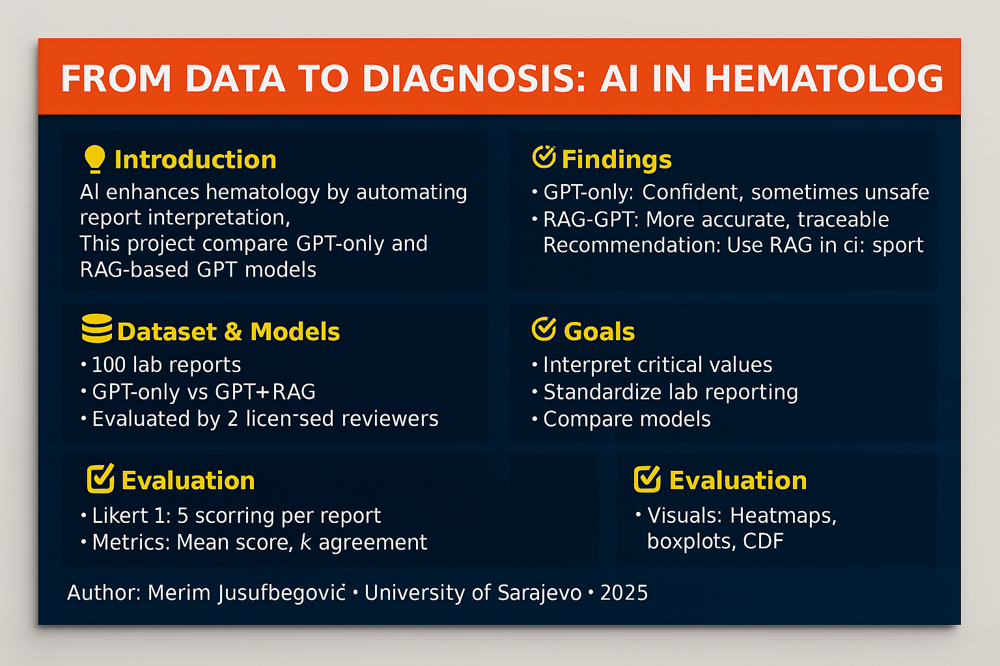

# 🧬 From Data to Diagnosis: Practical AI in Hematology

**A Comparative Study of GPT vs Retrieval-Augmented GPT for Lab Report Interpretation**

[](https://www.gnu.org/licenses/agpl-3.0)

---

## 🧠 Project Summary

This repository contains code, data, and evaluation results from the study:

> **"Enhancing Hematology Interpretation with RAG"**  
> *(Merim Jusufbegović, 2025)*

The study compares baseline GPT-4 and a retrieval-augmented GPT-4 (RAG) agent in interpreting hematology panels. Using 50 reports per model, two blinded experts scored each output on a 5-point Likert scale. Results show that RAG reduces clinically poor outputs and improves inter-rater reliability.

📄 Full paper: [`GPT_hematology_blood_analysis.pdf`](./docs/GPT_hematology_blood_analysis.pdf)

---

## 📂 Repository Contents

| Folder | Description |
|--------|-------------|
| `/data` | Lab dataset (100 patients), reviewer scores |
| `/src/hematology` | Core Python logic for lab analysis |
| `/results` | Summary table, graphs, and visuals |
| `/notebooks` | Colab-ready demo |
| `/docs` | Paper, how-to guides, and summaries |

---

## 🛠️ Quick Start (Local)
```bash
git clone https://github.com/yourusername/hematology-ai.git
cd hematology-ai
pip install -r requirements.txt

python src/hematology/analyzer.py
```

---

## 🚀 Try It in Colab
👉 [Open in Google Colab](https://colab.research.google.com/github/yourusername/hematology-ai/blob/main/notebooks/demo_colab.ipynb)

---

## 📊 Evaluation Results

| Model        | Reviewer | Mean Score | κ Agreement | % Good (4–5) |
|--------------|----------|------------|-------------|--------------|
| GPT (baseline) | R1      | 3.30       | -0.13       | 38%          |
| GPT (baseline) | R2      | 3.32       |             | 28%          |
| GPT + RAG     | R1      | 3.56       | 0.25        | 48%          |
| GPT + RAG     | R2      | 3.20       |             | 32%          |

---

## 🔁 Want to Run Your Own Study?

Switch to the `replication-template` branch:
```bash
git checkout replication-template
```

Use your own lab dataset and generate reports with:
```bash
python src/hematology/analyzer.py --input your_data.csv
```

---

## 🤝 Acknowledgements

- Faculty of Health Studies, University of Sarajevo
- Faculty of Electrical Engineering, University of Sarajevo
- OpenAI GPT-4 & RAG pipelines  
- Reviewers for scoring model output

---

## 📜 License

Licensed under the **GNU AGPL v3.0**.  
See [`LICENSE`](./LICENSE) for full terms.

---

## 🖼️ Project Visual Summary


