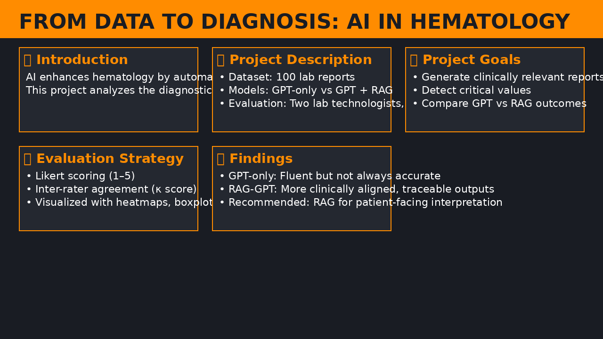

# 🧬 From Data to Diagnosis: Practical AI in Hematology

> **A Comparative Study of GPT vs Retrieval-Augmented GPT for Lab Report Interpretation**  
> _Author: Merim Jusufbegović, 2025_  
> 📄 [Full Paper PDF](./docs/GPT_hematology_blood_analysis.pdf)

---

---

## 📚 Table of Contents
- [🧠 Project Summary](#-project-summary)
- [📂 Repository Structure](#-repository-structure)
- [🛠️ Quick Start (Local)](#️-quick-start-local)
- [🚀 Try It in Colab](#-try-it-in-colab)
- [📊 Evaluation Results](#-evaluation-results)
- [🔁 Replicate the Study](#-replicate-the-study)
- [🤝 Acknowledgements](#-acknowledgements)
- [📜 License](#-license)

...

> 🧪 For research use only — not for clinical diagnosis without human oversight.
